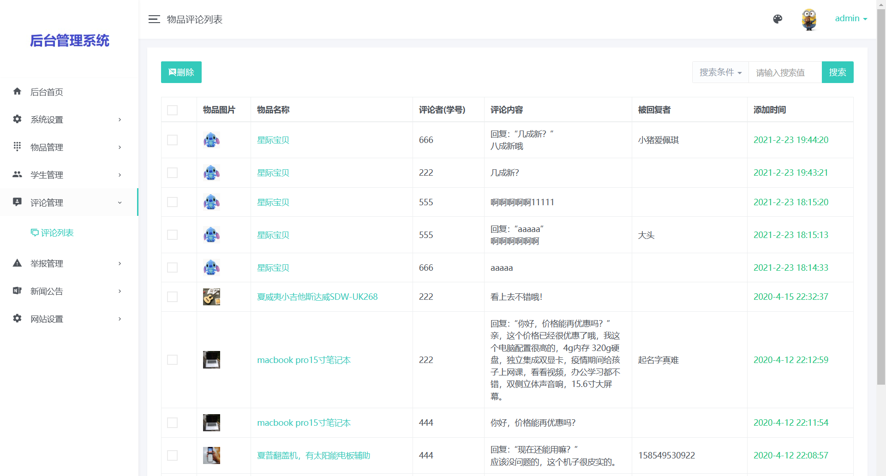
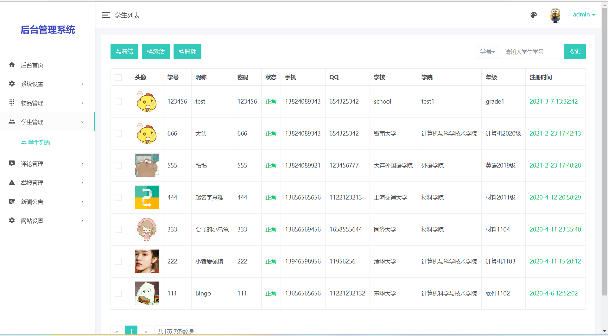

# 校园二手市场
##  9.9￥ 获取完整源码+sql，附赠11000字论文参考，附赠11000字论文参考，需要加Q：3808981644 备用Q：3577148218
## 有问题，或者需要协助调试运行项目的也可联系
## 一、介绍

基于springboot的校园二手交易平台

开发语言：java

运行环境:idea或eclipse 数据库:mysql

## 二、项目功能介绍

### 1、后台功能介绍
1、菜单管理  2、角色管理
3、用户管理 4、日志管理
5、数据备份 6、分类管理
7、物品管理 8、求购物品
9、用户管理 10、评论管理
11、举报管理 12、公告管理
13、网站设置 14、搜索功能

### 2、前台功能介绍
1、用户注册 2、用户注册 3、个人资料编辑 4、发布商品（卖） 5、购买商品（买） 6、求购专区 7、发表评论 8、搜索商品

## 三、后台部分页面展示

## 四、前台部分页面展示

## 五、 9.9￥ 获取完整源码+sql，附赠11000字论文参考，附赠11000字论文参考，需要加Q：3808981644 备用Q：3577148218
## 有问题，或者需要协助调试运行项目的也可联系

